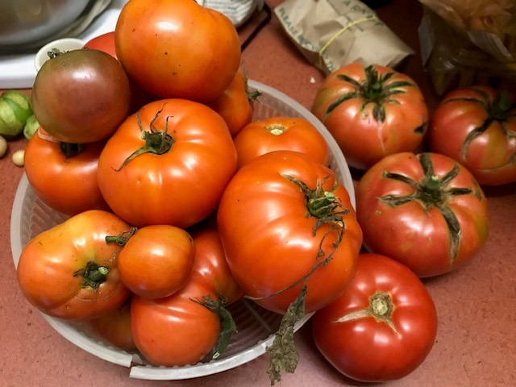

# How to make cheese toast

Cheese toast is another of my favorite summer treats. I only make it when _superb_ tomatoes are available. (I mean really, if the tomatoes aren't good, what's the point? You might as well eat pink tennis balls.) Typically, you can only find good tomatoes in July, August, and September. I grow my own, and they hit their peak around Labor Day.

1. Find a succulent tomato. In late summer I recommend the Brandywine variety.
2. Slice a few thick slices.
3. Slice a few thick slices of artisan bread. You know, the crusty kind.
4. Slice a few slices of sharp cheddar cheese and cover a slice of bread with the cheese.
5. Place the bread and cheese into a toaster oven and toast until the cheese has melted.
6. Slide a juicy slice of tomato onto the toast.
7. Enjoy a simple but wonderful late summer meal.
