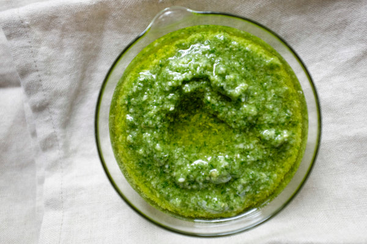

# How to make pesto

Pesto is a late summer treat.

You can also freeze pesto and defrost it for a taste of summer during the coldest months.
To learn about pesto's Genoese roots, see [How pesto originated](https://www.oliviersandco.com/pesto-originated).

1. Harvest your basil. Naturally you've been growing basil since early summer.
2. Pluck the smaller, most tender leaves. Avoid the big leathery leaves.
3. Pack two cups of plucked leaves into a blender.
4. Add the following ingredients:
   - One-half cup of pine nuts. I recommend purchasing pine nuts from Trader Joe. Most other sources are prohibitively expensive.
   - Pinch of salt.
   - At least two good sized cloves of garlic.
   - One-half cup of olive oil.
5. Run the blender at a medium speed until the contents are creamy.
6. Stir in one-half cup of ground parmesan cheese. If you want to save some pesto for later, only add cheese to the pesto you want to use immediately. Freeze the rest.
7. Enjoy over pasta, green beans, potatoes, grilled meat, or whatever your imagination calls for.
